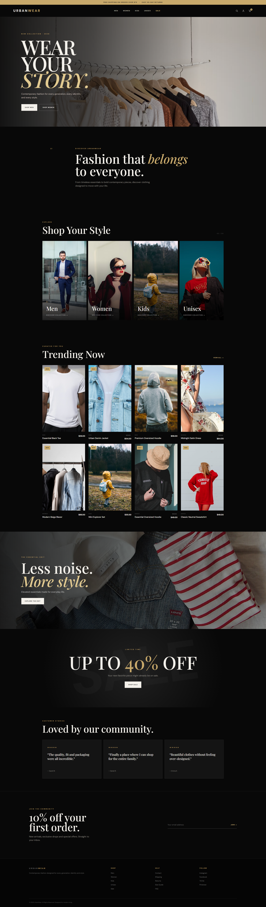

# 🖤 UrbanWear — Modern Clothing E-Commerce Platform

<p align="center">
  <strong>A premium, responsive clothing store built for modern online shopping.</strong>
</p>

<p align="center">
  <em>Men • Women • Kids • Unisex • Sale • AI-Powered Shopping Assistant</em>
</p>

<p align="center">


</p>

---

## 🖥️ Website Preview

<p align="center">
  
</p>

> **UrbanWear** is a full-stack clothing e-commerce platform designed to provide a modern, visually engaging, and seamless shopping experience across desktop, tablet, and mobile devices.

---

## ✨ Project Highlights

UrbanWear combines a modern e-commerce experience with an **AI-powered RAG shopping assistant**.

### 🛍️ E-Commerce

- Modern clothing storefront
- Men's collection
- Women's collection
- Kids' collection
- Unisex apparel
- Sale & clearance section
- Product detail pages
- Product filtering
- Product sorting
- Shopping cart
- Stock management
- Sale pricing
- Product categories
- Responsive product grids
- Featured products
- New-arrival products

### 🔎 Smart Product Discovery

Customers can explore products using:

- Size
- Color
- Price range
- Style
- Fabric
- Newest products
- Price: low to high
- Price: high to low
- Best-selling products

### 🤖 AI Shopping Assistant

UrbanWear also includes an AI-powered shopping assistant built with:

- Python
- LangChain
- Google Gemini
- Pinecone
- Retrieval-Augmented Generation (RAG)

The assistant can retrieve information from the store's private knowledge base and generate helpful answers for customers.

Example:

```text
Customer
   │
   ▼
"What is your return policy?"
   │
   ▼
Gemini Embedding
   │
   ▼
Pinecone Vector Database
   │
   ▼
Relevant Knowledge
   │
   ▼
Gemini
   │
   ▼
Helpful AI Response
```

---

# 🎯 Main Features

| Feature | Status |
|---|---|
| 🏠 Modern Homepage | ✅ |
| 👔 Men's Collection | ✅ |
| 👗 Women's Collection | ✅ |
| 🧒 Kids' Collection | ✅ |
| 🧥 Unisex Collection | ✅ |
| 🔥 Sale Collection | ✅ |
| 🔎 Product Filtering | ✅ |
| ↕️ Product Sorting | ✅ |
| 📦 Product Inventory | ✅ |
| 🛒 Shopping Cart | ✅ |
| 💰 Sale Pricing | ✅ |
| 📱 Responsive Design | ✅ |
| 🤖 RAG AI Backend | ✅ |
| 🧠 Gemini Embeddings | ✅ |
| 🌲 Pinecone Vector Search | ✅ |
| 📄 PDF Knowledge Base | ✅ |
| 💬 AI Chat API | ✅ |
| 🔐 Environment-based API Keys | ✅ |

---

# 🧠 AI & RAG Architecture

UrbanWear uses Retrieval-Augmented Generation to allow the AI assistant to answer questions using information from the store's knowledge base.

### Architecture

```text
                    ┌──────────────────────┐
                    │      Customer        │
                    └──────────┬───────────┘
                               │
                               ▼
                    ┌──────────────────────┐
                    │   UrbanWear Website  │
                    └──────────┬───────────┘
                               │
                               ▼
                    ┌──────────────────────┐
                    │     Flask API        │
                    └──────────┬───────────┘
                               │
                               ▼
                    ┌──────────────────────┐
                    │   RAG Retriever      │
                    └──────────┬───────────┘
                               │
                               ▼
                    ┌──────────────────────┐
                    │ Pinecone Vector DB   │
                    └──────────┬───────────┘
                               │
                     Relevant PDF chunks
                               │
                               ▼
                    ┌──────────────────────┐
                    │   Google Gemini      │
                    └──────────┬───────────┘
                               │
                               ▼
                    ┌──────────────────────┐
                    │    AI Response      │
                    └──────────────────────┘
```

---

# 🏗️ Technology Stack

### Frontend

- HTML5
- CSS3
- JavaScript
- Responsive design

### Backend

- Python 3.12
- Flask
- Flask-SQLAlchemy
- SQLite

### AI

- LangChain
- Google Gemini
- Gemini Embeddings
- Retrieval-Augmented Generation

### Vector Database

- Pinecone

### Data

- PDF knowledge base
- SQLAlchemy models
- SQLite database

### Development

- Git
- GitHub
- Python Virtual Environment

---

# 📁 Project Structure

```text
urbanwear-clothing-store/
│
├── docs/
│   └── screenshots/
│       └── homepage.png
│
├── models/
│   ├── __init__.py
│   └── product.py
│
├── routes/
│   ├── __init__.py
│   ├── products.py
│   ├── cart.py
│   └── chat.py
│
├── rag/
│   ├── __init__.py
│   ├── chat_model.py
│   ├── embeddings.py
│   ├── retriever.py
│   ├── ingest.py
│   ├── create_index.py
│   └── ...
│
├── static/
│   ├── css/
│   ├── js/
│   └── images/
│
├── templates/
│   ├── base.html
│   ├── index.html
│   ├── cart.html
│   ├── product_detail.html
│   └── ...
│
├── data/
│   └── *.pdf
│
├── app.py
├── config.py
├── requirements.txt
├── .env.example
├── .gitignore
└── README.md
```

---

# 🚀 Getting Started

## 1. Clone the repository

```bash
git clone https://github.com/Hozayfa-Ahsan/urbanwear-clothing-store.git
```

```bash
cd urbanwear-clothing-store
```

---

## 2. Create a virtual environment

### Windows

```powershell
python -m venv .venv
```

Activate it:

```powershell
.venv\Scripts\Activate.ps1
```

---

## 3. Install dependencies

```powershell
pip install -r requirements.txt
```

---

## 4. Configure environment variables

Create a `.env` file in the project root.

Example:

```env
SECRET_KEY=your_secret_key

GEMINI_API_KEY=your_gemini_api_key

PINECONE_API_KEY=your_pinecone_api_key

PINECONE_INDEX_NAME=urbanwear-rag
```

> Never commit your `.env` file to GitHub.

---

# ▶️ Run the Website

Start Flask:

```powershell
python app.py
```

Then open:

```text
http://127.0.0.1:5000
```

---

# 🤖 RAG Setup

The RAG system uses PDF documents as the knowledge source.

Place your PDF files inside:

```text
rag/data/
```

Then create the Pinecone index:

```powershell
python rag/create_index.py
```

Run PDF ingestion:

```powershell
python rag/ingest.py
```

Test the retriever:

```powershell
python rag/retriever.py
```

Test the complete AI response:

```powershell
python -m rag.chat_model
```

---

# 💬 AI Chat API

The chatbot backend exposes:

```text
POST /api/chat
```

Example request:

```json
{
  "message": "What is the return policy?"
}
```

Example response:

```json
{
  "success": true,
  "answer": "Your return policy information...",
  "sources": [
    "knwoledge.pdf"
  ]
}
```

---

# 🛒 Shopping Experience

The platform is designed around a simple customer journey:

```text
Discover
   ↓
Browse Collection
   ↓
Filter Products
   ↓
View Product
   ↓
Choose Size
   ↓
Add to Cart
   ↓
Review Cart
   ↓
Checkout
```

---

# 📸 Screenshots

### Homepage

<p align="center">
  
</p>

### Collection

Add your collection screenshot here:

```text
docs/screenshots/collection.png
```

### Product Details

Add your product screenshot here:

```text
docs/screenshots/product.png
```

### Shopping Cart

Add your cart screenshot here:

```text
docs/screenshots/cart.png
```

### AI Shopping Assistant

Add your chatbot screenshot here:

```text
docs/screenshots/chatbot.png
```

---

# 🔐 Security

Sensitive configuration is kept outside the repository.

The project uses:

- Environment variables
- `.env` protection
- `.gitignore`
- Server-side API communication
- No API keys exposed in frontend JavaScript

---

# 📈 Future Development

Planned enhancements include:

- [ ] Full AI chatbot frontend
- [ ] User authentication
- [ ] Customer accounts
- [ ] Wishlist
- [ ] Product reviews
- [ ] Order management
- [ ] Checkout system
- [ ] Multiple payment gateways
- [ ] Email notifications
- [ ] Admin dashboard
- [ ] Advanced inventory management
- [ ] AI product recommendations
- [ ] Conversation history
- [ ] Production deployment
- [ ] HTTPS configuration
- [ ] Advanced SEO
- [ ] Performance optimization

---

# 🌟 Vision

UrbanWear aims to combine **modern fashion e-commerce with practical AI assistance**, creating a shopping experience where customers can discover products, get instant answers, and make purchasing decisions through an intuitive digital storefront.

---

## 👨‍💻 Developer

**Hozayfa Ahsan**

Built with Python, Flask, JavaScript, LangChain, Google Gemini and Pinecone.

---

<p align="center">

### 🖤 UrbanWear

**Style. Simplicity. Intelligence.**

</p>
